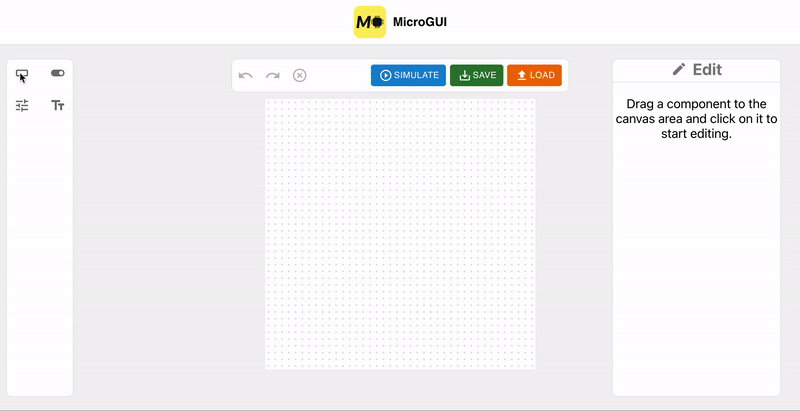

<div id="top" align="center">

[![Contributors][contributors-shield]][contributors-url]
[![Forks][forks-shield]][forks-url]
[![Stargazers][stars-shield]][stars-url]
[![Issues][issues-shield]][issues-url]
[![MIT License][license-shield]][license-url]
  
</div>

<!-- PROJECT LOGO -->
<br />
<div align="center">
  <a href="https://github.com/microgui/MicroGUI">
    
  </a>

  <h3 align="center">MicroGUI</h3>

  <p align="center">
    An open-source tool for creating embedded GUIs!
    <br />
    <a href="https://github.com/microgui/MicroGUI/wiki"><strong>Explore the docs »</strong></a>
    <br />
    <br />
    <a href="https://github.com/microgui/MicroGUI/issues/new?labels=bug">Report Bug</a>
    ·
    <a href="https://github.com/microgui/MicroGUI/issues/new?labels=enhancement">Request Feature</a>
  </p>
</div>

<!-- TABLE OF CONTENTS -->
<details>
  <summary>Table of Contents</summary>
  <ol>
    <li>
      <a href="#about-the-project">About The Project</a>
      <ul>
        <li><a href="#architecture">Built With</a></li>
      </ul>
    </li>
    <li>
      <a href="#getting-started">Getting Started</a>
      <ul>
        <li><a href="#prerequisites">Prerequisites</a></li>
        <li><a href="#installation">Installation</a></li>
      </ul>
    </li>
    <li><a href="#usage">Usage</a></li>
    <li><a href="#contributing">Contributing</a></li>
    <li><a href="#license">License</a></li>
    <li><a href="#contact">Contact</a></li>
    <li><a href="#acknowledgments">Acknowledgments</a></li>
  </ol>
</details>

<!-- ABOUT THE PROJECT -->
## About The Project
<div align='center'>
<a href="https://github.com/microgui/MicroGUI">
  
</a>
</div>

Use the MicroGUI web application to create simple GUIs using ready-made components! Components include buttons, switches, sliders and textfields (more to come!).

<p align="right">(<a href="#top">back to top</a>)</p>

### Architecture

* [React.js](https://reactjs.org/)
* [MUI](https://mui.com)
* [Craft.js](https://github.com/prevwong/craft.js)

<p align="right">(<a href="#top">back to top</a>)</p>

<!-- GETTING STARTED -->
## Getting Started

### Prerequisites

Download [Node.js](https://nodejs.org/en/download/).

Get the latest NPM version.
* npm
  ```sh
  npm install npm@latest -g
  ```

### Installation

1. Clone the repository
   ```sh
   git clone https://github.com/microgui/MicroGUI.git
   ```
2. Change directory to _MicroGUI_
   ```sh
   cd your_repo_location/MicroGUI
   ```
3. Install NPM packages
   ```sh
   npm install
   ```
4. Run the app
   ```sh
   npm start
   ```
5. Open the app\
   Go to ```localhost:3000``` in the browser

<p align="right">(<a href="#top">back to top</a>)</p>

<!-- USAGE -->
## Usage

Drag any component onto the canvas area and start moving it around freely, or edit its appearance. You can choose to "simulate" the current state of the canvas area, which removes the ability to move and edit components. You can also save the state of the canvas area by copying to clipboard or downloading a file.

<!-- CONTRIBUTING -->
## Contributing

Contributions are what make the open source community such an amazing place to learn, inspire, and create. Any contributions you make are **greatly appreciated**.

If you have a suggestion that would make this better, please fork the repo and create a pull request. You can also simply open an issue with the tag "enhancement".
Don't forget to give the project a star! Thanks again!

1. Fork the Project
2. Create your Feature Branch (`git checkout -b feature/AmazingFeature`)
3. Commit your Changes (`git commit -m 'Add some AmazingFeature'`)
4. Push to the Branch (`git push origin feature/AmazingFeature`)
5. Open a Pull Request

<p align="right">(<a href="#top">back to top</a>)</p>

<!-- LICENSE -->
## License

Distributed under the MIT License. See `LICENSE.txt` for more information.

<p align="right">(<a href="#top">back to top</a>)</p>

<!-- CONTACT -->
## Contact

Carl Classon - carl.classon@hotmail.com

William Husar - william.husar@hotmail.com

<p align="right">(<a href="#top">back to top</a>)</p>

<!-- ACKNOWLEDGMENTS -->
## Acknowledgments

Helpful resources

* [react-draggable](https://github.com/react-grid-layout/react-draggable)
* [react-dnd](https://github.com/react-dnd/react-dnd)
* [craft.js example](https://craft.js.org)

A big thanks to [@othneildrew](https://github.com/othneildrew) for the [README template](https://github.com/othneildrew/Best-README-Template).

<p align="right">(<a href="#top">back to top</a>)</p>

<!-- MARKDOWN LINKS & IMAGES -->
<!-- https://www.markdownguide.org/basic-syntax/#reference-style-links -->
[contributors-shield]: https://img.shields.io/github/contributors/microgui/MicroGUI.svg?style=for-the-badge
[contributors-url]: https://github.com/microgui/MicroGUI/graphs/contributors
[forks-shield]: https://img.shields.io/github/forks/microgui/MicroGUI.svg?style=for-the-badge
[forks-url]: https://github.com/microgui/MicroGUI/network/members
[stars-shield]: https://img.shields.io/github/stars/microgui/MicroGUI.svg?style=for-the-badge
[stars-url]: https://github.com/microgui/MicroGUI/stargazers
[issues-shield]: https://img.shields.io/github/issues/microgui/MicroGUI.svg?style=for-the-badge
[issues-url]: https://github.com/microgui/MicroGUI/issues
[license-shield]: https://img.shields.io/github/license/microgui/MicroGUI.svg?style=for-the-badge
[license-url]: https://github.com/microgui/MicroGUI/blob/main/LICENSE.md
[product-screenshot]: images/canvas.png
